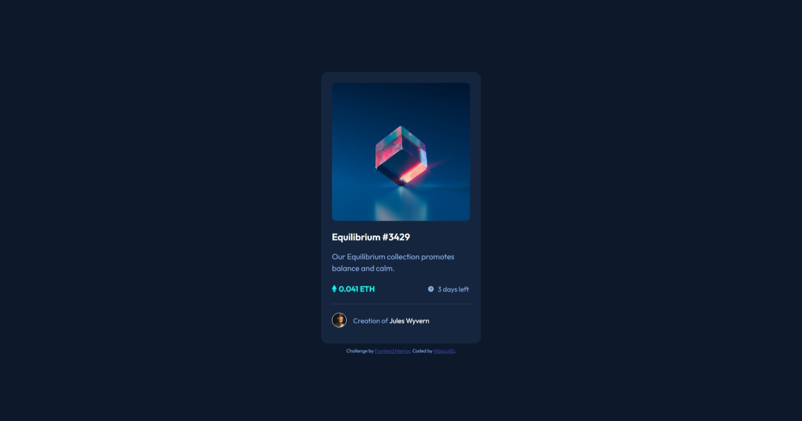
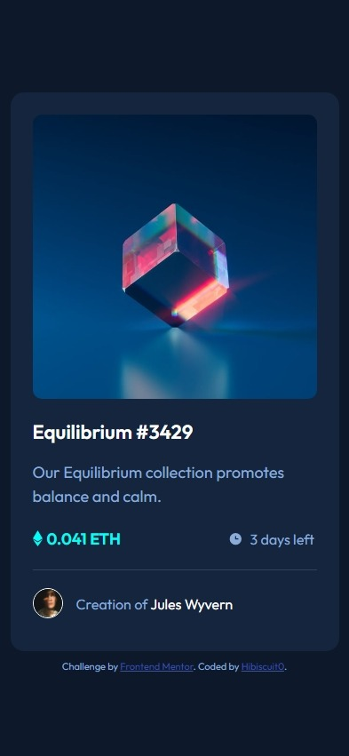
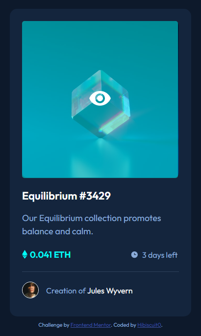

# Frontend Mentor - NFT preview card component solution

This is a solution to the [NFT preview card component challenge on Frontend Mentor](https://www.frontendmentor.io/challenges/nft-preview-card-component-SbdUL_w0U). Frontend Mentor challenges help you improve your coding skills by building realistic projects. 

## Table of contents

- [Overview](#overview)
  - [The challenge](#the-challenge)
  - [Screenshot](#screenshot)
  - [Links](#links)
- [My process](#my-process)
  - [Built with](#built-with)
  - [What I learned](#what-i-learned)
  - [Continued development](#continued-development)
  - [Useful resources](#useful-resources)
- [Author](#author)


## Overview

### The challenge

Users should be able to:

- View the optimal layout depending on their device's screen size
- See hover states for interactive elements

### Screenshot
- View on laptop (1920 x 1080 px) from Edge

- Simu view of Pixel5 on Edge (393 x 851px)

- Image overlay



### Links

- Solution URL: [https://github.com/Hibiscuit0/FrontEndMentor-NFTCardPreviewComponent](https://github.com/Hibiscuit0/FrontEndMentor-NFTCardPreviewComponent)
- Live Site URL: [https://front-end-mentor-nft-preview-card-component.vercel.app/](https://front-end-mentor-nft-preview-card-component.vercel.app/)

## My process

### Built with

- Semantic HTML5 markup
- CSS custom properties
- Flexbox


### What I learned

I learned how to make overlay effects when hovering an image.

```html
    <article>
      
      <div class="viewHover"></div>
    </article>
```
```css
article {
    position: relative;
}

.viewHover {
    position: absolute;
    top: 0;
    left: 0;
    padding: calc(50% - 26px) calc(50% - 25px);
    border-radius: 5px;
    background-color: hsl(178, 100%, 50%, 0.5);
    opacity: 0;
}

.viewHover:hover {
    cursor: pointer;
    transition: ease-in 300ms;
    opacity: 1;
```

### Continued development

I need to continue learning to create easy components like this one to be able to do it fast.

### Useful resources

- [Overlay example](https://www.w3schools.com/HOWTO/howto_css_image_overlay_title.asp) - W3School overlay on an image explanations


## Author

- Frontend Mentor - [@Hibiscuit0](https://www.frontendmentor.io/profile/Hibiscuit0)
